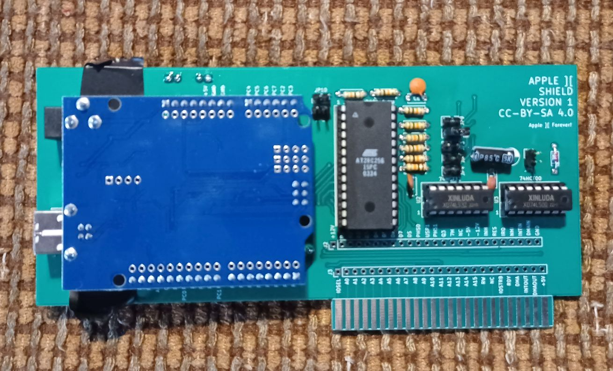

# Apple II Arduino Shield

This is a simple card to interface an Apple II bus to an Arduino Uno or an Arduino Shield using the 82C55 interface.  If stackable headers are soldered into the interface card, an Arduino Uno may be mounted on the back of the card, and shields may be stacked on the front of the card.  This way an Arduino Shield may be used without an Arduino by the card by bit-banging it with the 82C55, or an Arduino may control the card.  There is also a ROM on the board that can contain your own firmware if you desire, and the hardware to flash it.  The design is derived from another project http://www.github.com/profdc9/Apple2Card

